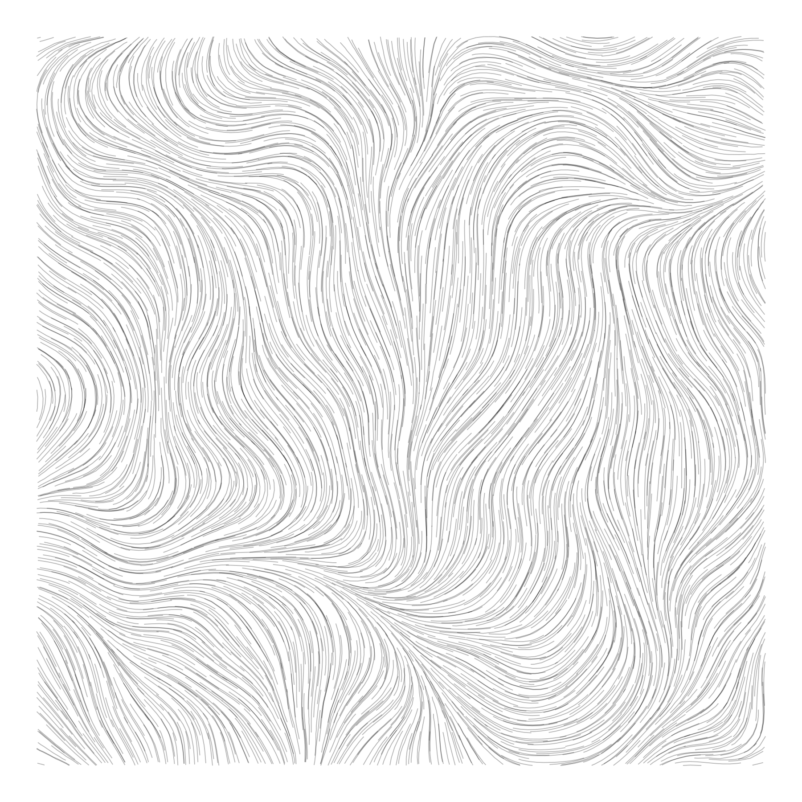

<!-- README.md is generated from README.Rmd. Please edit that file -->

# flow

<!-- badges: start -->
<!-- badges: end -->

This is a package with functions to generate a flowfield and populate it
with trails.

## Installation

You can install the development version of flow from
[GitHub](https://github.com/) with:

``` r
# install.packages("devtools")
devtools::install_github("robbrotherton/flow")
```

## Example

``` r
library(flow)
#> 
#> Attaching package: 'flow'
#> The following object is masked from 'package:graphics':
#> 
#>     grid

ff <- make_flowfield(angle = 2, octaves = 4)
p <- particles_poisson(5000, lims(ff))

make_trails(ff, p, 
            max_steps = .2, 
            step_length = .005) |> 
  draw_trails(alpha = .3, size = .2)
```


